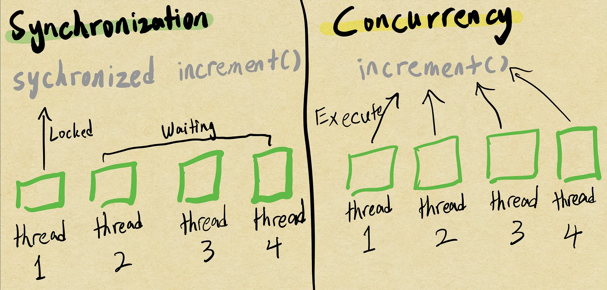

## Synchronization
In Java, the `synchronized` keyword is to establish mutually exclusive access to code blocks or methods. This means that only one thread can enter the synchronized code at any given time. By doing so, it safeguards against potential issues like data inconsistencies and race conditions that might arise when multiple threads attempt to modify shared resources simultaneously.

Synchronized keyword provides a simple way to create synchronized blocks or methods, ensuring that only one thread can access the synchronized code at any given time. The intrinsic lock, also known as the monitor, guards the critical section from concurrent access. While easy to use, `synchronized` might lead to thread contention and reduced performance in highly concurrent scenarios.

Example of `synchronized`:
```kotlin
public class SynchronizatonDemo {

  public static void main(String[] args) {
    Counter counter = new Counter();

    Runnable task = () -> {
      for (int i = 0; i < 100; i++) {
        counter.increment();
      }
    };
  
    Thread thread1 = new Thread(task);
    Thread thread2 = new Thread(task);
  
    // Execute by order
    thread1.start();
    thread2.start();
  
    try {
      // Queue up
      thread1.join();
      thread2.join();
    } catch (InterruptedException e) {
      e.printStackTrace();
    }
  
    /**
     * You will get the Output: "Final Count: 200" as synchronized keyword
     * allowed only one thread to enter at a time. In thread1 it have achieved
     * 100 counts and thread2 will continue it.
     */
    System.out.println("Final Count: " + counter.getCount());
  }
}

class Counter {
  private int count = 0;

  public synchronized void increment() {
    count++;
  }
  
  public synchronized int getCount() {
    return count;
  }
}
```

## Concurrency
The `java.util.concurrent` package in Java offers a comprehensive collection of tools and data structures specifically designed to manage complex multithreading situations with ease and efficiency. These utilities provide higher-level abstractions and optimized implementations, making them well-suited for handling tasks in highly concurrent environments.

Some key classes in this package, such as `ConcurrentHashMap`, `ConcurrentLinkedQueue`, and `ExecutorService`, offer significant advantages over traditional synchronized blocks or methods.

In the Spring Framework, they provide a alternative similar package called `org.springframework.scheduling.concurrent`, which builds upon the core Java utilities and offers enhanced compatibility when used within a Spring application.

Example of `java.util.concurrent`:
```kotlin
import java.util.concurrent.ExecutorService;
import java.util.concurrent.Executors;
import java.util.concurrent.TimeUnit;
import java.util.concurrent.atomic.AtomicInteger;

public class ConcurrencyDemo {

  private static final int NUM_THREADS = 4;

  public static void main(String[] args) {
    Counter counter = new Counter();
    ExecutorService executorService = Executors.newFixedThreadPool(NUM_THREADS);

    for (int i = 1; i <= 100; i++) {
      final int taskId = i;
      executorService.submit(() -> {
        counter.increment();
        System.out.println("Executed Task " + taskId);
      });
    }

    executorService.shutdown();

    // Wait for all tasks to complete
    try {
      executorService.awaitTermination(Long.MAX_VALUE, TimeUnit.NANOSECONDS);
    } catch (InterruptedException e) {
      e.printStackTrace();
    }

    /**
     * You will get the Output: "Final Count: 100" as java.util.concurrent
     * packages provided the executions concurrently.
     */
    System.out.println("Final Count: " + counter.getCount());
  }
}

class Counter {
  /**
   * AtomicInteger ensuring that updates to the counter are
   * thread-safe without the need for explicit synchronization
   */
  private AtomicInteger count = new AtomicInteger(0);

  public void increment() {
    count.incrementAndGet();
  }

  public void decrement() {
    count.decrementAndGet();
  }

  public int getCount() {
    return count.get();
  }
}
```

## Comparison
1. When to use `synchronized` vs. `java.util.concurrent`:
- Use `synchronized` for basic concurrency needs involving limited shared resource access. It’s easier to implement but might not scale well in highly contested situations.
- For more complex concurrency needs with precise control and improved performance, opt for `java.util.concurrent` classes. They provide lock-free algorithms and optimized data structures, reducing contention and enhancing scalability.

2. Performance:
- In simple situations with a few threads, `synchronized` is sufficient and easy to use. But with more threads, contention for the lock can slow down performance. In contrast, `java.util.concurrent classes` like AtomicInteger allow multiple threads to modify data concurrently without locking, resulting in better throughput and scalability.

---

## Closing thoughts:
Synchronization and concurrency are vital skills in software development. Mastering them allows you to create efficient, high-performing applications that handle modern demands. Embrace the challenges and explore innovative solutions. Stay curious and never stop learning!

*Thank you for staying with me until the end 👀. If this article brought value or knowledge to you, consider supporting my work by sharing it with others. Additionally, connect with me on [LinkedIn](https://www.linkedin.com/in/ken-shen-chong-6b9a47193) or follow me on [GitHub](https://github.com/kenshenn) to explore more insightful tips, articles, and discoveries that I share there* 😉.

